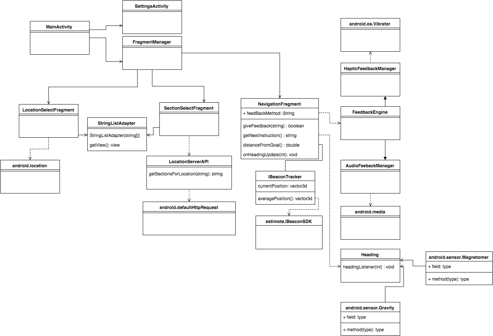
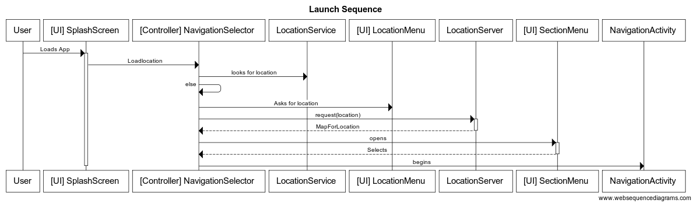

# A research project in indoor navigation using IBeacon technology, with a focus on the blind or partially sighted

## Features

* Android application
  * Indoor location tracking using iBeacon 
    * Proximity based tracking based on single iBeacon proxmity
    * Full 2d tracking based on triangulation of >= 3 iBeacons
  * Sight impaired navigation (Haptic or Audio based)
  * Sight impaired friendly UI navigation 
    * Menu to select a location, (IE. Lakeview Market, Orchard Park Mall)
    * Menu to select a section in said location, (IE. Product section, Food Court)
  
* Server side application to define locations and upload new locations 
  * Hosts locations for android application to download
  * Ability to upload/define new loctations 
  * 

## Requirements

### Non-functional Requirements
* User should be able to navigate app without sight
* User should be able to select between haptic and audio feedback
* User should be able to select their location
* User should be able to select a section in their location to navigate to
* User should be able to get feedback on how far they are from their destination
* User should be able to cancel navigation and re-select location or section
* A server should host config details for locations so that users can easily navigate a new location

### functional requirements
* App should be able to know its position within +-2 meters of the actual position indoors
* App should be easily deployable to a new location through a config file
* Config file documented be clearly defined and documented
* 

## Challenges

* iBeacon distance accurracy
 * iBeacons have an accuracy of +- 1 Meter from within 10 meters, and worse if the device is > 10 meters away. This will present a challenge in getting accurate location data while using both triangulation and basic proximity based tracking.
 * To combat this an algorithm that averages the readings over time and then triangulates could be use, this is going to be one of the primary areas of research for the project
* Determining a viable method of providing feedback to users who are sight impaired
 * Audio feedback is an easy solution, but not preferred as it is disruptive
 * A better solution would be to develop a haptic feedback system where different vibration patterns mean different things (Left or Right)

## Todo (In order or importance)

1. Basic android app that interfaces with the IBeacon
2. Add menus of locations to app and develop UI
3. Heading and directional tracking (IE, N-S-E-W) in order to give turn based Navigation
4. Navigational feedback for a user from the app (Haptic or voice)
5. Basic location tracking using IBeacon (Simple proximity based tracking)
6. Location triangulation using IBeacon (More exact proximity based tracking)
7. Pinpoint navigation of sections in a store (Lakeview market test)
8. Server/client communication between mobile device and server for configuration data and additional tracking information
9. Interpret location configuration files from server on device

## Timeline

Todo Item | Scheduled Completion | Status
--------- | -------------------- | ---------------
Basic App / Basic Diagrams / Features / Requirments | September 29th, 2015 | September 29th, 2015
Menus and UI    | October 13th, 2015 | N/A
Heading/direction tracking | October 20th, 2015 | [Completed](milestones/oct20-2015.md)
Testing/development of feedback system | November 3rd, 2015 |[Completed](milestones/nov3-2015.md)
Implementation of feedback system into application | November 17th, 2015 | N/A
Triangulation testing and algorithm development | December 1st, 2015 | N/A
Implementation of the triangulation method into application | December 8th, 2015 | N/A
Ability to navigate to specific section of store | December 15th, 2015 | N/A
Create a configuration format for locations and interpret on device | Jan 5th, 2015 | N/A
Setup up location configuration server for device to pull locations from | Jan 12th, 2016| N/A
Extra Time (Possibly increase test coverage/fix bugs) | Feb 2nd, 2016| N/A
Thesis | March 15th, 2016 | N/A
Presentation Prep| April 5th, 2016 | N/A
Presentation | April 14th, 2016 | N/A

## Distractions

* Christmas Break, 1-2 weeks off
* Reading Break second semester, 1 week off, feb 15-19th 2016

## UML

### Class Diagram

### Sequence Diagram for app launch

